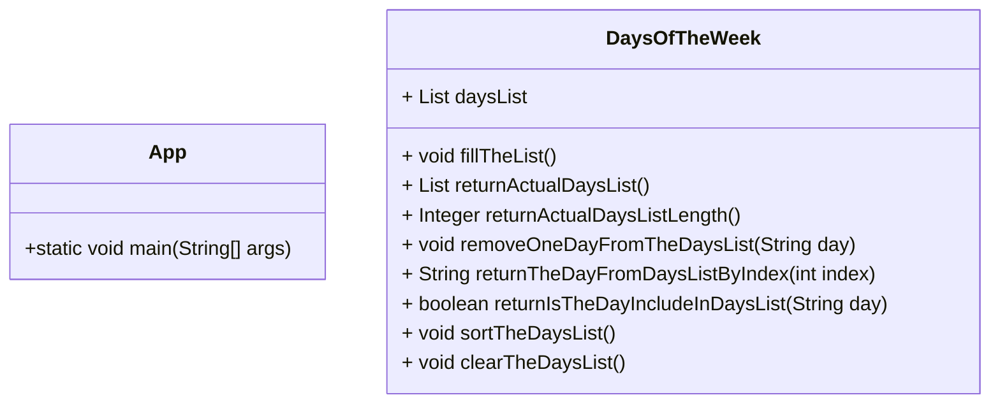
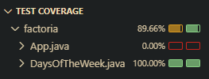

# 📌 Week Days Management

## ✅ Class Requirements

Create a class responsible for managing the days of the week.

1. A method to create the list of days of the week  
2. A method that returns the list of days of the week  
3. A method that returns the length of the list  
4. A method to remove a day from the list  
5. A method that returns the requested day of the week  
6. A method that returns whether the requested day exists in the list  
7. A method to sort the list of days alphabetically  
8. A method to clear the list  

---

## 📜 Additional Requirements

- Unit tests must be implemented for each method  
- The `List` collection from `java.util` must be used  

---

## 📊 Class Diagram (Mermaid)

---

## 🧪 Test Coverage

  